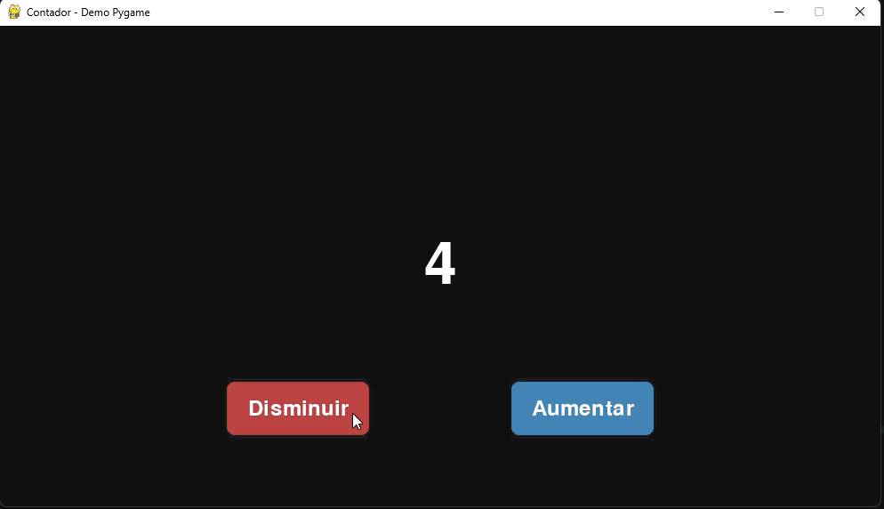
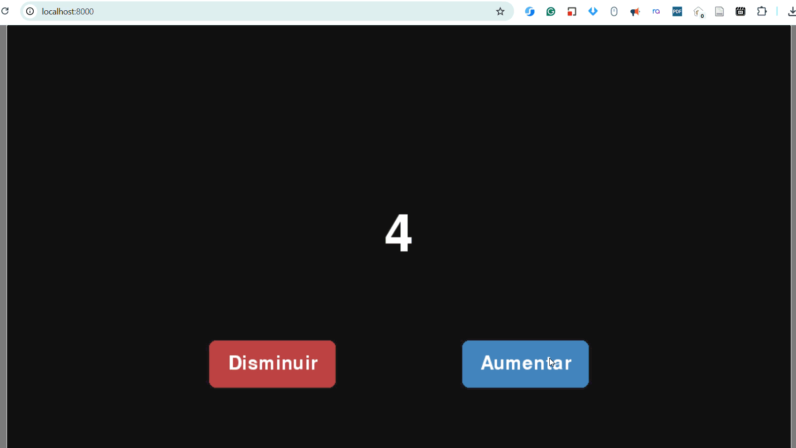

# Demos of pygame project as a web version

This repository contains example projects showing how to run a Pygame application in a web browser using pygbag.

The goal is to make it easy to build a Pygame UI and then run it in the browser without changing the game logic too much. This is a simple example project intended as a starting point for experiments, prototypes, and browser-based game demos.

## Requirements

Before starting, make sure you have:

- Python 3.12 or newer
- uv installed on your system
- A modern web browser

# Game jumper

```bash
$ pygbag game_jump
```


# Simple Counter

```bash
$ uv run demo/main.py
```


## Using uv

This project uses uv to manage dependencies and create the project environment.

After cloning the repository, open a terminal in the project root and run:

```bash
$ uv sync
```

This will install the required dependencies, including:

- pygame
- pygbag

## Run the demo in the browser

Once the environment is ready, launch the web version of the demo with:

```bash
$ pygbag demo
```

This command starts pygbag and builds the Pygame project so it can run inside a browser.

After it starts, follow the local URL shown in the terminal to open and play the demo in your browser.



## Project structure

- `demo/` contains the example Pygame app
- `main.py` is the entry point for local Python execution
- `pyproject.toml` defines the project and dependencies

## Notes

This repo is meant as a simple example of using Pygame in a web browser with pygbag. It is a good starting point for anyone who wants to test browser deployment for their own interactive Pygame projects.
